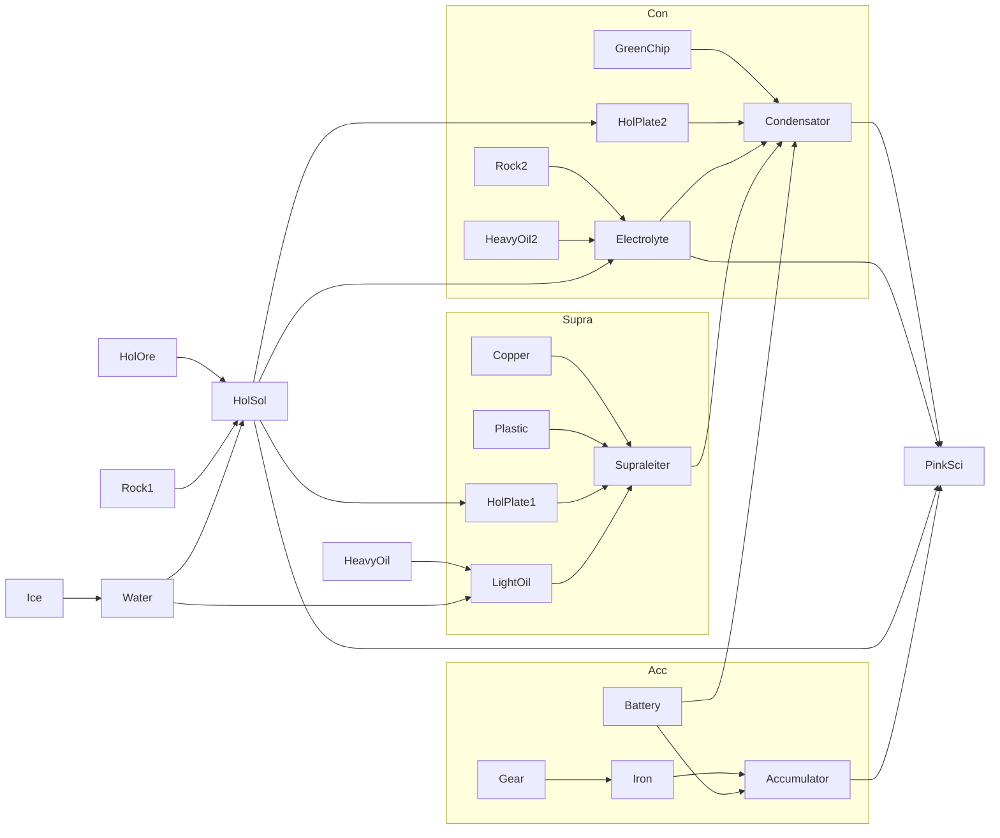

```mermaid
flowchart LR

subgraph Acc
Battery
Gear
Iron
Accumulator
end
HolOre-->HolSol
Rock1-->HolSol

subgraph Supra
Supraleiter
Copper
Plastic
HolPlate1
LightOil
end
HolSol--->HolPlate1
HolSol--->HolPlate2
Copper-->Supraleiter
Plastic-->Supraleiter
HolPlate1-->Supraleiter
LightOil-->Supraleiter

subgraph Con
Rock2-->Electrolyte
HeavyOil2-->Electrolyte
Electrolyte
GreenChip
Condensator
HolPlate2
end 

Gear-->Iron
Iron-->Accumulator
Battery-->Accumulator

Ice-->Water
Water-->HolSol
HolSol-->Electrolyte
Condensator-->PinkSci
Electrolyte-->PinkSci
HolSol-->PinkSci
Accumulator-->PinkSci
Battery-->Condensator
GreenChip-->Condensator
HolPlate2-->Condensator
Electrolyte-->Condensator
Supraleiter-->Condensator

HeavyOil-->LightOil
Water-->LightOil
```
