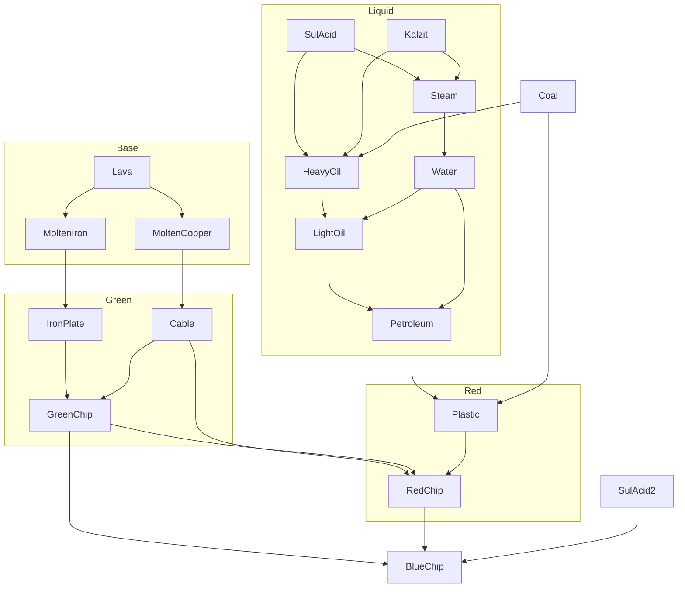

```mermaid
flowchart TB

Lava-->MoltenIron
Lava-->MoltenCopper

subgraph Base
Lava
MoltenIron
MoltenCopper
end

subgraph Green
Cable
IronPlate
GreenChip
end

subgraph Red
Plastic
RedChip
end

subgraph Liquid
SulAcid
Kalzit
Steam
HeavyOil
Water
LightOil
Petroleum
end


MoltenIron-->IronPlate
MoltenCopper-->Cable

IronPlate-->GreenChip
Cable-->GreenChip

SulAcid-->HeavyOil
Kalzit-->HeavyOil
Coal-->HeavyOil

HeavyOil-->LightOil
Water-->LightOil

SulAcid-->Steam
Kalzit-->Steam

Steam-->Water

LightOil-->Petroleum
Water-->Petroleum

Petroleum-->Plastic
Coal-->Plastic

Cable-->RedChip
GreenChip-->RedChip
Plastic-->RedChip

GreenChip-->BlueChip
RedChip-->BlueChip
SulAcid2-->BlueChip
```
